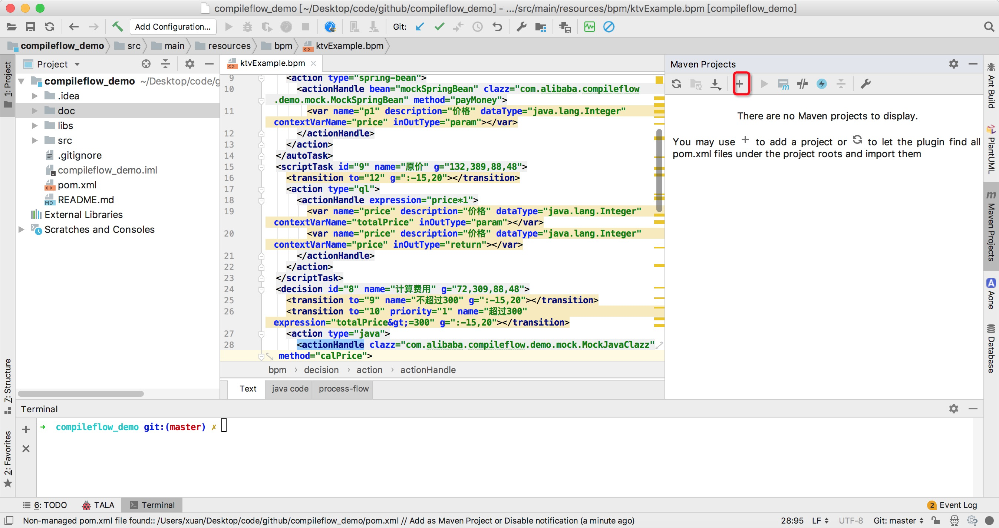
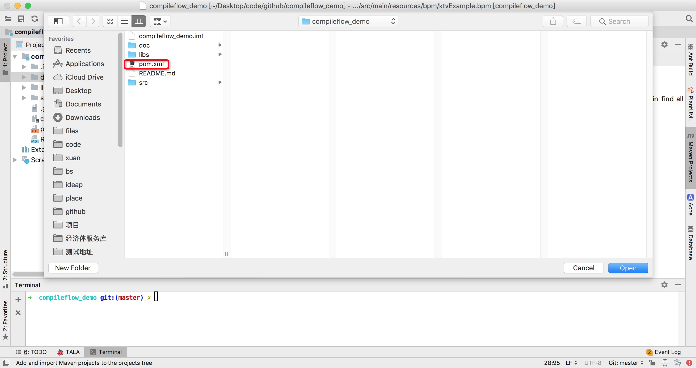

# Compileflow Demo

使用[`compileflow`引擎](https://github.com/alibaba/compileflow)的demo，方便快速入门。

使用了`springboot`方式，具体请看代码。

## demo运行

由于没有上传`IDE`工程文件如`IntelliJ IDEA`的`.idea`，所以`idea`打开demo时如果报：`Non-managed pom.xml file found`，那么请按下图配置`maven`环境即可:  

选中`pom.xml`：  

最后运行`DemoApplication`就能启动程序。
