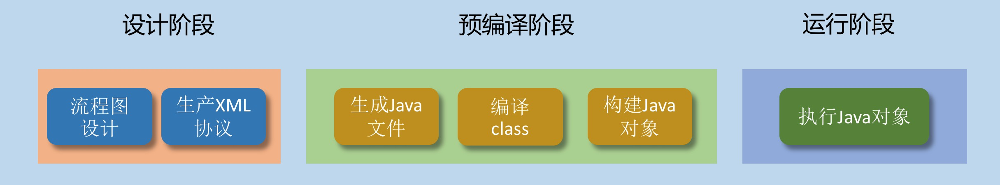
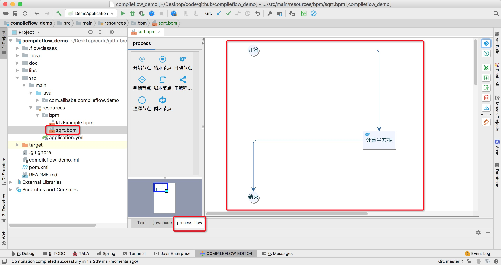
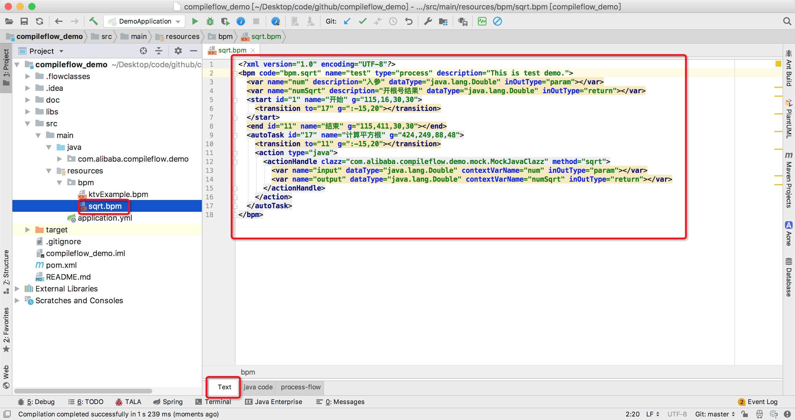
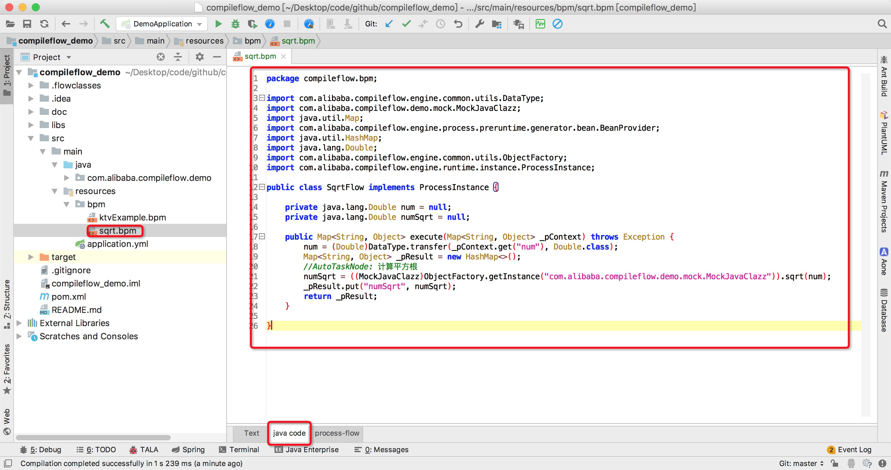

# 1、引子
还记得我们的研发流程是什么样的么？虽然研发模式百花齐放，在不同团队都有自己的一套研发流程。但是最本质的不会变。一般我们拿到需求，进行评审完毕后就开始做制作技术方案。而在这个过程中，流程图是我们一定会画的。无论你是如何面向对象设计。要完成一件事情，设计一段逻辑，流程图是最好的表现方式，可以让你清楚的了解程序的具体运行步骤。

问题来了，大家应该都有这样一种经历。尽管前期流程图设计的有多完美。等编码的时候，总会有这样那样的问题，导致偏离原本设计的流程。于是，当后人拿到代码，再对比技术方案，会惊叹的发现，什么鬼。代码和技术方案上的流程图完全对不上。这就是我们常说的，文档不可靠，要想了解一手细节，直接看代码是最有效最直接的方式。但往往，在不了解逻辑的整个流程前，死扣代码是多么生涩难懂多么痛苦的。

compileflow解决了上面代码流程的可视化。让设计流程和写代码融为一体。你看到的流程，就是运行的代码。当然，他的存在不仅仅是用来解决可视化的问题。这里只是当一个引子来讲。

# 2、设计思路
compileflow主要分下面几个阶段：

一般一个流程有开始节点、结束节点、分支节点、函数执行节点等等。compileflow设计了一套协议，可以利用该协议编辑一份XML，XML对应一段流程的执行逻辑。当然本质上是compileflow会识别XML，并生成一个java类，再编译成class，加载内存后反射生存对象缓存起来。等引擎需要执行指定XML的流程时，其实就是执行了被创建好的对象类。是不是觉得有点像DSL设计编程。因为XML编辑还不算友好。所以我们同时配套开发了一款Idea插件，可以像其他流程图设计软件一样通过可视化的方式绘制流程图。绘制完成后，就能自动产生XML文件了。


# 3、案例说明
### 3.1 需求：
这里通过一个简单的案例，来说明上面的几个阶段，都干了些什么。例如我们收到一个需求，需要编写一段逻辑，开一个数的平方根。

### 3.2 方案设计：
针对这个需求，按之前的讨论，我们需要设计一个类，里面有一个方法。其入参就是一个数。然后这个方法逻辑就是开这个数的平方根。然后返回参数就是被开过后的平方根的值。然后利用compileflow我们是这样做的：

####（1）设计阶段（流程图设计）（非必选）
针对上面的case，我们可以用插件设计器，先把流程图画出来。如下：

当然我们还需要双击流程图空白的地方和节点处进行入参变量的设置。这里不做展开。详细可以去[访问插件首页](https://github.com/alibaba/compileflow-idea-designer)了解。


####（2）设计阶段（生产XML协议）
设计器会自动把可视化的流程转成XML协议。所以第一步是非必选，如果你了解XML协议。你也可以手动编辑生产。

其实你自己研究下这个协议，还是比较简单的。当然除了支持淘宝内部的协议。后面也会去支持业内的bpmn协议。不过个人觉得淘宝内部的协议相对比较简洁一点。

#### (3) 预编译阶段（生成Java文件、编译class、构建java对象）
这个过程是发上在第一次执行流程时，或者说在系统启动时，进行预load处理。例如，在我们的demo例子中，当Spring启动时，就开始加载xml。[demo地址](https://github.com/xuan698400/compileflow_demo)
```
/**
 * 注意：这里是想让系统启动时，预先加载bpm流程到内存，防止第一次调用时，初始化流程所带来的耗时
 *
 * @author xuan
 * @since 2020/8/16
 */
@Component
@Configuration
public class BpmInitializer implements InitializingBean {

    @Override
    public void afterPropertiesSet() throws Exception {
        ProcessEngine processEngine = ProcessEngineFactory.getProcessEngine();
        processEngine.load("bpm.ktvExample");
        processEngine.load("bpm.demo");
    }

    @Bean
    public SpringApplicationContextProvider getSpringApplicationContextProvider() {
        return new SpringApplicationContextProvider();
    }

}
```
* 生成Java文件：compileflow会去识别这个XML，然后把他翻译一个Java类。如果说，把XML协议看出一种简单的编程语言。那么compileflow在这里就充当了编译器。高级编程语言的存在，就是为了让人类可以更友好的编码。但最终高级语言还是会被编译成最低级的机器语言。最后是一串CPU能识别的二进制指令。而compileflow是把程序的流程可视化掉，比高级编程语言更向人类贴近一步。如下图是利用插件预编译生成java代码。
* 生成Java文件后，再动态编译成class文件。
* 最后根据class文件，加载到内存，利用反射生产对象后，会缓存到内存MAP里面，其中key就是XML协议里面的code属性。

### （4）运行阶段（执行java对象）
在执行流程时，我们会要求指定XML的code。其实这个时候，上面的步骤已经完成的差不多了。
引擎唯一要做的就是，从缓存MAP里面根据code取到对应对象，执行拿到结果就行。

```
public void run2() {
    //code在bpm文件中定义
    String code = "bpm.sqrt";

    //执行流程的入参
    Map<String, Object> context = new HashMap<>();
    context.put("num", 4);

    try {
        ProcessEngine processEngine = ProcessEngineFactory.getProcessEngine();
        Map<String, Object> result = processEngine.start(code, context);
        System.out.println(result.get("numSqrt"));
    } catch (Exception e) {
        e.printStackTrace();
    }
}
```

# 4、更多可能
上面很好的解决了代码流程的可视化。当流程异常复杂时，我们可以清晰的看到整个流程图。当然，compileflow不仅仅满足于此。就像java一样，JVM不仅仅可以加载本地class文件，还可以通过网络加载class文件来进行运行。那同理，compileflow其实也可以支持来自网络的XML协议。例如存储在DB。我们可以构建一个流程中心，把所有流程进行统一管理。当我们仅仅需要替换流程的其中一个节点时，我们只需要重新推送XML协议到流程中心，再由流程中心推送协议到运行机器。这样就可以实现流程逻辑的动态扩展。（当然前提是节点的逻辑可复用）等等。上面只是基于compileflow一种扩展案例。目前我们还在努力的完善中。例如：开放WEB设计器，eclipse设计器，以及支持更多的bpmn协议，还有提供springboot的starter等等。任道重远。

# 附件：
* [compileflow引擎开源地址](https://github.com/alibaba/compileflow)
* [compileflow-idea-designer设计器开源地址](https://github.com/alibaba/compileflow-idea-designer)
* [demo入门项目地址](https://github.com/xuan698400/compileflow_demo)